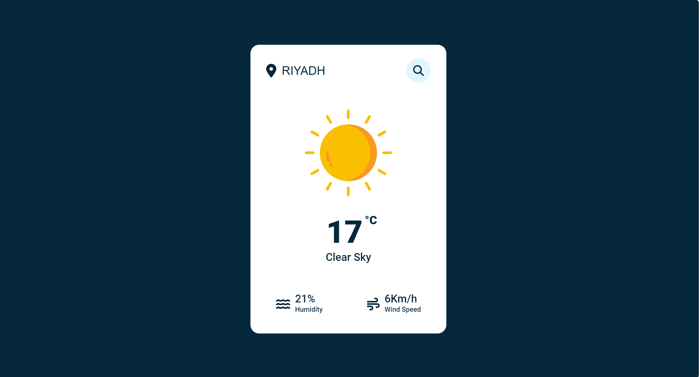

# 🌦️ Weather App

A simple application that displays the current weather for any city around the world using the OpenWeatherMap API.

## 📸 Preview

## 🚀 Features

- Search for the weather in any city.
- Displays temperature, humidity, and wind speed.
- Clean and easy-to-use UI.
- Weather condition icons (Sunny, Rainy, Cloudy, etc.).
- Error messages for invalid locations.

## 🛠️ Built With

- HTML5, CSS3, JavaScript (Vanilla)
- OpenWeatherMap API
- Font Awesome
- Google Fonts
